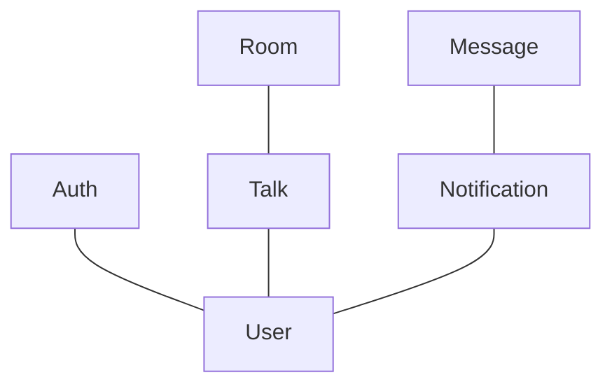
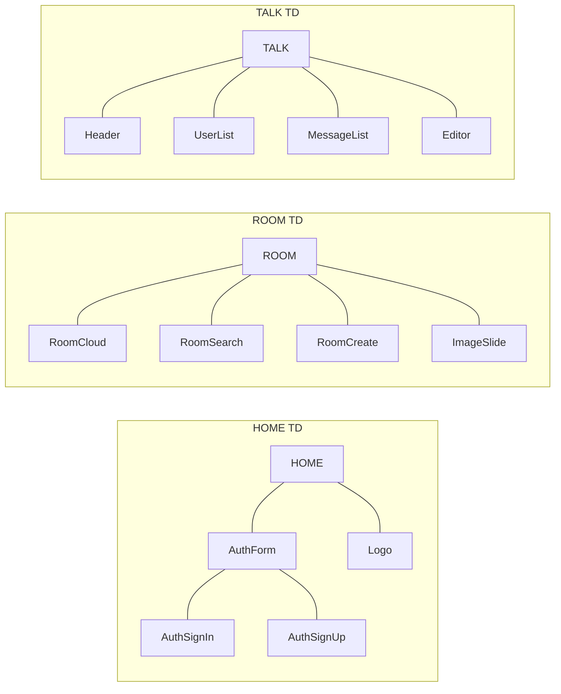

## Repartition

* button  : thomas*
* avatar  : cyriaque
* image-slider  : norbert
* message  : cyriaque
* message-list  : vincent
* notifier : ludovic
* room-card : christophe
* room-cloud : raf > . <
* room-creator : didier
* room-searh : didier
* talk-editor : raf > . <
* talk-header : younes
* user-list : constant
* user-profile : younes

## EZ-MIOU

> THE PURR CHAT

## Fonctionnalities

* User
* Message
* Room
* Talk
* Notification

* User
    * signin
    * signup
    * signout
    * sendMessage
    * createRoom
    * joinRoom
* Notification
    * pop
* Sorage
    * local
        * read
        * save
        * flush
    * remote
        * read
        * save

## DATA

* Auth
* Room
* Talk
* Message
* Notification
* User

## EVOL

* P2P
* Mute user
* Gestion status
* Upload
* User power

