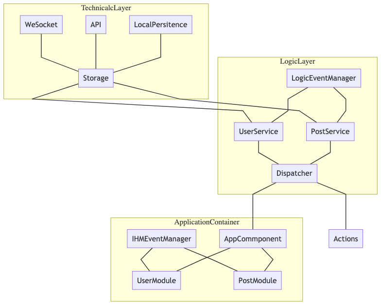

# EcmaScript / TypeScrit / React


## JavaScript Pattern :

* `Factory`
* `Service` (Isolation de la Business Logique)
* `MVC`
* `Singleton`
* `command pattern`
* `Provider`
* `Module`
* `Facade`


## ES5 

Array :
* `map`
* `reduce`
* `filter`
* `sort`
* `every` -> Boolean
* `some` -> Boolean

```js

const numbers = [1,2,3,4,5,6];

const cap = numbers.map(n => n / 1.5 ).some( n => n > 5 );

```

## ES5 / ES6

* Code Hoisting.
* Scope.
    * Global `window`, `module`, `function`, `block`
    * Context `this`, par défaut evaluer dynamiquement.
* Mutations.
* Modéle protoypal.
* Asynchronicité : Attention `Mono Stack` !!! 
    * `Mono Thread` + `Mono Stack` - `Web Worker`
    * `callback` + `Event : systeme nommé de gestion des cb` - `promise`, `Observable`.

> Si projet ES6 abandonné `var`

* `let const class =>`
* Destructuration : `object` ou `array`

## ES6 : Module

> Un module est un fichier javascript chargé en isolation `scope`
* `export`
* `import`

**Peu avoir** un seul export par `default`

```js

import WhatEver from './module';

export const NamedValue = 42;
export const NamedValue = () => true ;

export default 12;

```

## Coding Guide Style 

* `var` - Banned
* `'` - String Simple Quote - Si necessaire template.
* Fonction en `arrow function =>`
* 150 Characteres
* Tableaux alignès
* `const` par défaut, `let` quand nécessaire.
* Pas de `if` sans `{`.
    * `{` en fin de ligne.

## React : Coding Guide Style 

* Interface First
    * Props Interface !== Props Data
* `export default Component` 
    * Bas de fichier
* `defaultProps` fichier externe
* Utiliser `classNames`

## React : Syntaxe de template

```jsx
<div 
    className={stringExpress} 
    style={Object}
    onClick={functionExpression}>
{
    stringExpression || componnet || HTMLElement || expression
}
</div>

```

## React : Component 

> Penser a `bind` les variables passer a un event.

### Usage des `state`

> `class` avec la property `state`
> `function` avec le hook `useState`

## Anti Pratique

* `eval`
* `new Function`
* `new String()`
* `new Number()`
* `new Boolean()`

### Outils

* Storybook
    * `stories.tsx`
    * `knob`
    * `action`
* Angular Console

### React Input Handler


```tsx

import React from 'react';

export class De extends React.Component{

    state = {
        login:'',
        password:''
    }

    myInput = React.createRef<HTMLInputElement>();
    // Ref sur  HTML Element - Element (this.myInput.current)
    // Ref sur  Component - Class du component

    passwordHandler = (event) => {
        this.setState({password:event.target.value})
    }
    loginHandler = (event)=> {
        this.setState( (prevState,props)=>({login:event.target.value}))
    }

    inputHandler = name => (event:any) => {
         this.setState( (prevState,props)=>({[name:any]:event.target.value}))
    }

/*     inputHandler(name){
        
        return function(event:any){

        }
    } */

    render(){
        
        const {login,password} = this.state;
        
        return(
            <React.Fragment>
                <input name="withRef" ref={this.myInput}/>
                <input name="lgn" value={login} onChange={this.inputHandler('login')}/>
                <input name="pwd" value={password} onChange={this.passwordHandler}/>
            </React.Fragment>
        );
    }
}
export default De;
```


### ES6: Destructuration


```js

const [ /* valeur ignorée */,one,two] = [0,1,2];
const {name:aliasName} = {name:'bob',age:42};
```

## JavaScript : Asynchronicité

> Fondamentalement s'appuie sur les `callbacks`

* `callbacks`
* Event : `callbacks` delegués à une Event Loop et identifié `eventName`.
* `Promise` : pour exprimé sequentiellement le code asynchrone.
* `Observable` : pour unifier les concepts précédents.

Convention `callbacks` : premier paramètre pour l'erreur.
DOM Event `callbacks` : `Handler` recoit l'object event en paramètre.

## Web - Component

> Entendre le WEB (HTML) de composant fonctionnels personnalisés.

Une recette - Un modéle a suivre (peut étre une `class`)
* Une logique
* Un template

Un LifeCycle :
1. Conception `constructor`
2. Adoption : rattaché au DOM ou `mounted`
3. Change : un chqngement à refleté.
4. Destroy / Mort / Disconneted / Wazzzzzaaaaa

## S.O.L.I.D.

> SOLID Principls...

* `S`ingle Responsibility Pattern
* `O`penc/Close
    * > On ne modifie pas ce que l'on n'a pas créé
* `L`iskov, SUBSTITUTION
* `I`nterface Segregation
    * > Préserver les séparation.
* `D`ependency Inversion 
     * > Couplage Lâche

## Performance :

* Temps de chargement initial 
    * Parsing - JS - CSS 
* Maintenabilité
* Usabilité - TTI
* Execution - `16.5ms` - `setTimeout` - `requestAnimationFrame`
    * CSS
    * DOM trop complexe.
    * XHR
* Memory Consumption 


## Projet TypeScript :

> Interface, Interface, Interface


## React

> Component, utiliser des fonction par défaut.

Utiliser des class pour les states. (Attention on peut aussi gérer les state dans les fonction)

* Functional Component
* Class Component

> Paramétrables avec des `props` , `props.children` recoit toujours ce aui est projeté dans la balise

## Services Layers

